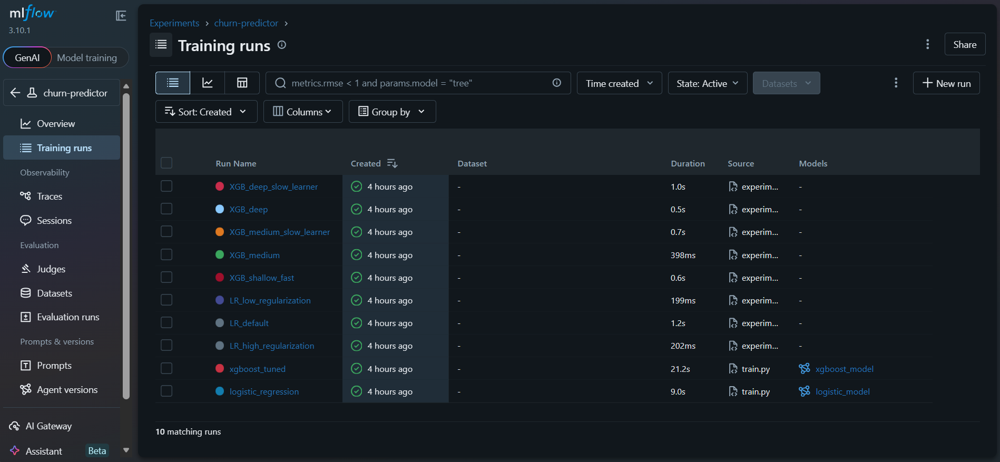
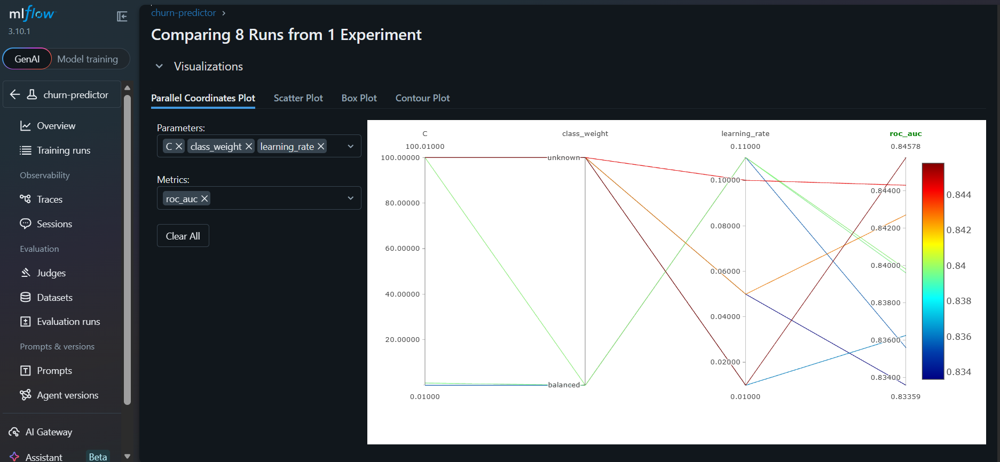
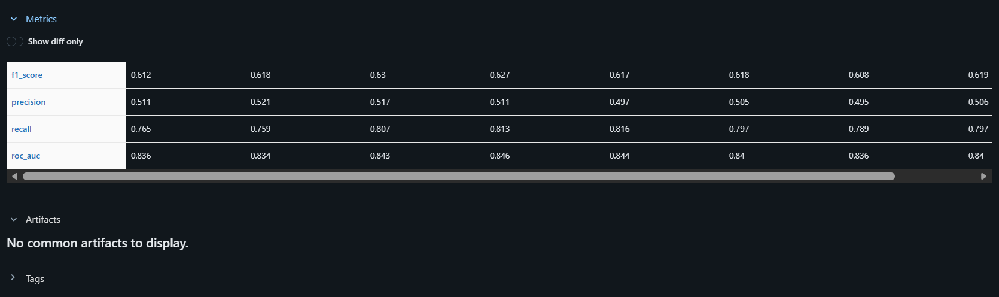

# 🛡️ ChurnShield — Adaptive ML Churn Intelligence System

> An intelligent ML system that dynamically routes predictions through the optimal model based on confidence — from Logistic Regression to XGBoost to LLM reasoning.


## 🚀 Live Demo
**API:** https://khfvihs1232-churn-predictor.hf.space
**Docs:** https://khfvihs1232-churn-predictor.hf.space/docs

---

## 🧠 What Makes This Different

Most churn predictors just run one model blindly. ChurnShield thinks:
```
Customer Data
      ↓
[Adaptive Router]
      ↓
┌─────────────────┬─────────────────┬─────────────────┐
│ Logistic Reg    │    XGBoost      │   LLM Reasoning │
│ confidence >85% │ confidence >55% │ confidence <55% │
└─────────────────┴─────────────────┴─────────────────┘
      ↓
Churn Probability + Risk Label
      ↓
SHAP Explanation (top 3 reasons)
      ↓
LLM Business Insight + Retention Strategy
```

This is called **cascading inference** — a real pattern used at Google, Netflix, and Uber in production ML systems.

---

## 📊 Model Performance

| Model | ROC-AUC | Precision | Recall | F1 |
|-------|---------|-----------|--------|-----|
| Logistic Regression | 0.840 | 0.51 | 0.80 | 0.62 |
| XGBoost (tuned) | 0.848 | 0.53 | 0.78 | 0.63 |

Best XGBoost params found via RandomizedSearchCV (30 combinations, 5-fold CV):
- `max_depth=4` · `learning_rate=0.01` · `n_estimators=500` · `subsample=0.7`

---

## 📈 MLflow Experiment Tracking

8 experiments tracked comparing Logistic Regression vs XGBoost across different hyperparameters:





**Key finding:** depth=4 with slow learning rate (0.01) outperformed deeper models — going to depth=6 caused overfitting, clearly visible in the comparison dashboard.



---

## 💡 Example API Response
```json
{
  "churn_probability": 0.89,
  "churn_risk": "HIGH RISK",
  "model_used": "logistic_regression",
  "confidence": "high",
  "top_reasons": [
    "Month-to-month contract increases churn risk",
    "Tenure of 2 months increases churn risk",
    "Monthly charges of $90 increases churn risk"
  ],
  "needs_llm": false,
  "llm_insight": null,
  "recommendation": "Immediate intervention needed — offer retention discount or dedicated support"
}
```

---

## 🔥 Key Features

- **Adaptive routing** — dynamically picks the right model per prediction based on confidence
- **SHAP explainability** — top 3 business reasons per prediction
- **LLM insights** — Llama 3.3 70B generates human readable retention strategies for uncertain cases
- **Production FastAPI** — Pydantic validation + auto Swagger docs
- **MLflow tracking** — 8 experiments logged, compared, and visualized
- **Dockerized** — runs anywhere with one command

---

## 🛠 Tech Stack
```
ML:          Scikit-learn · XGBoost · SHAP
LLM:         Groq API (Llama 3.3 70B)
API:         FastAPI · Uvicorn · Pydantic
MLOps:       MLflow experiment tracking
Deploy:      Docker · HuggingFace Spaces
Data:        Kaggle Telco Churn (7043 customers)
```

---

## 📁 Project Structure
```
ChurnShield/
├── data/
│   ├── telco_churn.csv
│   └── telco_churn_clean.csv
├── models/
│   ├── logistic_model.pkl
│   ├── xgb_model.pkl
│   ├── scaler.pkl
│   └── feature_names.pkl
├── notebooks/
│   └── 01_eda.ipynb
├── src/
│   ├── train.py            # Training + MLflow logging
│   ├── experiments.py      # 8 experiment runs
│   ├── main.py             # FastAPI app
│   ├── adaptive_router.py  # Model routing logic
│   ├── shap_explainer.py   # SHAP explanations
│   └── llm_insights.py     # Groq LLM integration
├── assets/                 # Screenshots
├── Dockerfile
└── requirements.txt
```

---

## 🚀 Run Locally
```bash
git clone https://github.com/meghzz10725/churn-predictor
cd churn-predictor
pip install -r requirements.txt

# Train models
cd src && python train.py

# Start API
uvicorn main:app --reload
```

---

## 📊 EDA Insights

- Month-to-month customers churn **3x more** than yearly contract customers
- Median tenure of churned customers: **10 months** vs 38 months for retained
- Higher monthly charges (>$65) correlate with increased churn probability
- Senior citizens show **15% higher** churn rate than non-seniors

---

## 🎯 Resume Bullet Points

- Built ChurnShield — adaptive ML system routing predictions across LR/XGBoost/LLM based on confidence scores, deployed live via FastAPI on HuggingFace
- Implemented SHAP explainability returning top 3 business reasons per prediction with human-readable retention strategies via Groq LLM
- Tracked 8 MLflow experiments identifying optimal XGBoost config (AUC 0.848) — depth=6 showed clear overfitting vs depth=4